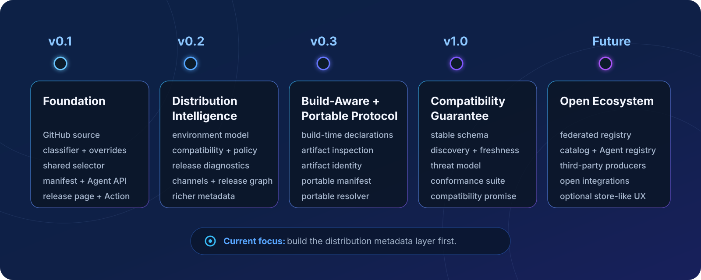

<p align="center">
  
</p>

<p align="center"><strong>面向用户与 Agent 的软件发布。</strong></p>

<p align="center">
  <a href="https://github.com/Zachery-Liu/Facade/actions/workflows/ci.yml"></a>
  <a href="https://github.com/Zachery-Liu/Facade/actions/workflows/codeql.yml"></a>
  <a href="https://github.com/Zachery-Liu/Facade/actions/workflows/dependency-review.yml"></a>
  <a href="LICENSE"></a>
  <br>
  <a href="https://github.com/Zachery-Liu/Facade/issues"></a>
  <a href="https://github.com/Zachery-Liu/Facade/pulls"></a>
  <a href="https://github.com/Zachery-Liu/Facade/commits/main"></a>
  
  
</p>

<p align="center">
  <a href="README.md">English</a> · 简体中文
</p>

Facade 将软件发布转化为清晰的下载体验和结构化的分发元数据。当前首先面向 GitHub Releases：软件产物继续保留在发布者自己的 Release 基础设施中，Facade 负责归一化“它是什么、适用于谁、应该如何被用户和 Agent 理解”。

Facade **不代理软件下载、不凭空制造信任，也不会静默执行安装命令**。

## 当前状态

**v0.1 正在持续实现中。**

仓库已经不再只是规划阶段。目前已经具备：

- 严格的 TypeScript / pnpm 工程结构与 CI 质量门禁；
- 基于 fixtures 的 Schema 与语义校验；
- 确定性的离线端到端构建，可生成 `index.html`、`manifest.json`、
  `install.md` 和 `llms.txt`；
- `basePath` 处理，以及带 staging、替换保护和回滚机制的安全输出流程；
- GitHub Release Source，可读取仓库元数据、latest/tag Release，并分页获取附件；
- 稳定的 Source 错误码、有界重试，以及内部 Source → Build 集成路径。

当前公开 CLI 仍然刻意保持很小：`facade build` 目前从离线
RepositorySnapshot fixture 构建。在线 GitHub CLI 接入、GitHub
Action / Pages、完整分类与人工覆盖、共享 Selector、`inspect`、Product
Theme，以及完整 Agent 契约仍属于 v0.1 后续工作。

## v0.1 正在构建什么

v0.1 的目标是一条确定、可解释的完整链路：

```text
GitHub Release
    ↓
Source
    ↓
Classifier
    ↓
维护者覆盖规则
    ↓
共享 Selector
    ↓
ReleasePageManifest
    ↓
User UI + Agent Interface
```

用户界面和 Agent 接口必须共享同一份归一化事实：

```text
面向用户
  index.html

面向 Agent
  manifest.json
  install.md
  llms.txt
```

首版主要验证常见桌面软件与 CLI 分发目标：

- **操作系统：** macOS、Windows、Linux
- **架构：** x64、arm64、universal；条件允许时支持 x86
- **格式：** dmg、pkg、exe、msi、zip、tar.gz、deb、rpm、AppImage

分类必须保持保守：未知就是未知；文件名推断不等同于维护者声明；分类和推荐是两件不同的事。

## 当前开发 CLI

当前 CLI 主要用于开发阶段的 fixture 构建：

```bash
facade build \
  --fixture <repository-snapshot.json> \
  --out-dir dist \
  --base-path /
```

仓库开发环境要求 Node.js `>=22.13.0` 与 pnpm `11.19.0`：

```bash
pnpm install
pnpm typecheck
pnpm lint
pnpm test
pnpm coverage
pnpm build
```

等 npm 包、GitHub Action 与在线 Source 流程稳定后，再补充面向最终用户的安装和发布说明。

## 路线图

<p align="center">
  
</p>

Facade 的长期演进遵循逐层建立基础设施的思路，而不是从“Release 页面生成器”直接跳到一个庞大的平台：

```text
v0.1  软件发布分发基础
  ↓
v0.2  Distribution Intelligence
  ↓
v0.3  Build-Aware + Portable Protocol
  ↓
v1.0  Compatibility Guarantee
  ↓
      Registry
  ↓
      Catalog + Agent Software Registry
  ↓
      Open Ecosystem + Integrations
```

长期方向包括：与具体 Source 解耦的分发协议、稳定 Artifact Identity、一等
Environment 兼容模型、基于 Capability 的解析、Policy-aware Selection、
编译期声明、Artifact Inspection、可移植 Manifest、联邦式 Registry，以及第三方
Producer / Consumer。

核心原则可以概括为：

> 与其在发布之后越来越聪明地猜，不如让事实尽可能在产物生成时就被声明出来。

完整规划见 [Roadmap](docs/roadmap.md) 与
[路线图中文版](docs/roadmap.zh-CN.md)。

## 设计原则

- **单一事实来源。** 用户界面、Agent Interface、CLI 消费者以及未来 Registry
  应共享同一份归一化事实和 Resolver 语义。
- **推断不等于声明。** 文件名猜测只能作为 evidence，而不是 ground truth。
- **未知是合法状态。** 无法可靠判断时保留 `unknown`，而不是制造确定性。
- **分类不等于推荐。** 识别出附件是什么，不代表它自动成为首选下载项。
- **优先可解释。** 分类、维护者声明、选择结果和证据链都应该可以检查。
- **默认确定性。** 等价输入应产生稳定的归一化输出。
- **事实优先于执行。** Facade 先描述和解析软件，再考虑任何 installer-like 行为。
- **归一化证据，而不是制造信任。** 可以表达 checksum、signature、SBOM、
  provenance 和 attestation，但不能声称证据没有证明的事情。
- **长期与 Source 解耦。** GitHub Releases 是第一个 Source Adapter，而不是永久的协议边界。
- **开放生态优先。** 发布者应该能够拥有自己的元数据，第三方工具也应该能独立生产或消费
  Facade-compatible Manifest，而不依赖某个中心化托管服务。

## 范围边界

Facade 是软件分发元数据与解析项目，而不是一个通用 Package Manager。

当前并不以这些方向为目标：

- 二进制下载代理或 CDN；
- 账号与支付平台；
- 依赖求解器；
- 静默执行安装命令的系统；
- 发布者必须依赖的中心化服务；
- 把推断元数据显示成已经验证的事实。

Installer 或 Store-like UX 只属于很远期的可选探索，并不是当前承诺。

## 参与项目

Facade 仍处于足够早的阶段，协议与数据模型还可以根据真实使用情况演进。Issues、实现反馈、
fixtures、Source Adapter、构建系统集成、Conformance、独立 Consumer 等贡献都很有价值。

如果准备提出较大的语义或协议改动，建议先参考产品基线与 Roadmap，再讨论具体实现。

## 文档

- [开发文档索引](docs/README.md)：开发与设计文档入口及约定。
- [产品基线](docs/facade_product_plan.md)：产品范围、语义、架构、契约、UX 与验收标准。
- [实施计划](docs/implementation_plan.md)：按依赖排序的 v0.1 执行计划与发布门槛。
- [Roadmap](docs/roadmap.md)：从 Distribution Intelligence 到开放软件分发协议与生态的长期方向。
- [Roadmap（简体中文）](docs/roadmap.zh-CN.md)：Roadmap 中文同步版本。
- [质量门禁](docs/quality-gates.md)：CI 检查与当前合并规则。
- [Trellis 工作流](.trellis/workflow.md)：项目任务生命周期与 AI 协作流程。

## 开源协议

本项目采用 [GNU Affero General Public License v3.0（AGPL-3.0-only）](LICENSE)。
